# SASE  Template Instructions

## Welcome

The SASE template can quickly be used to turn up a Cisco SD-WAN environment that can connect out to various SASE vendors for platform lab use.

The template is currently present in our vCloud perm environment.  This is necessary as the environment needs to remain static to function properly.  The template does work in conjunction with another template in the sandbox environment that provides Windows VMs and connects to the perm environment via VxLan.  

## Access

| **Device Name**     | **Credentials** | **SSH/RDP/HTTP(S)** | **IP**    | **Port** |
| :------------------ | --------------- | ------------------- | --------- | -------- |
| CSR-GW              | local admin     | SSH                 | Perm-vApp | 22       |
| vManage             | local admin     | SSH                 | Perm-vApp | 1235     |
| vManage             | local admin     | HTTPS               | Perm-vApp | 8443     |
| vSmart              | local admin     | SSH                 | Perm-vApp | 1236     |
| vBond               | local admin     | SSH                 | Perm-vApp | 1237     |
| VxLan-Hub           | local admin     | SSH                 | Perm-vApp | 1239     |
| Branch1-vEdge       | local admin     | SSH                 | Perm-vApp | 1238     |
| Branch2-cEdge       | local admin     | SSH                 | Perm-vApp | 1240     |
| Remote-CSR          | local admin     | SSH                 | Perm-vApp | 1241     |
| INET-TJ             | no login        | HTTP                | Perm-vApp | 8080     |
| INET-TJ             | wwtatc          | SSH                 | Perm-vApp | 1234     |
| AD/DNS Server       | local admin     | RDP                 | Perm-vApp | 3389     |
| CL-Core             | local admin     | SSH                 | Perm-vApp | 1242     |
| VyOS                | local admin     | SSH                 | Prod-vApp | 22       |
| Branch1-Win10-Corp  | local admin     | RDP                 | Prod-vApp | 65010    |
| Branch1-Win10-Guest | local admin     | RDP                 | Prod-vApp | 65011    |
| Branch2-Win10-Corp  | local admin     | RDP                 | Prod-vApp | 65012    |
| Branch2-Win10-Guest | local admin     | RDP                 | Prod-vApp | 65013    |
| Remote-Win10        | local admin     | RDP                 | Prod-vApp | 65014    |


## HLD

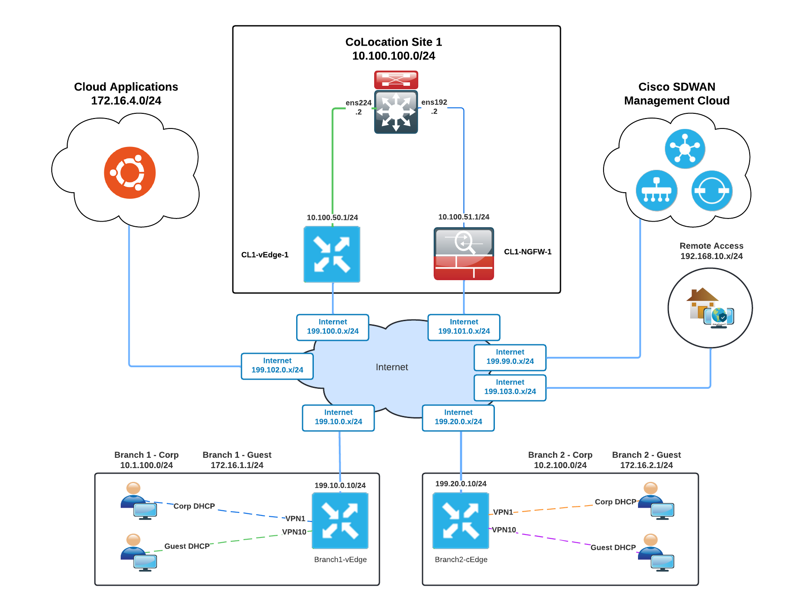

## Tunnel Backhaul

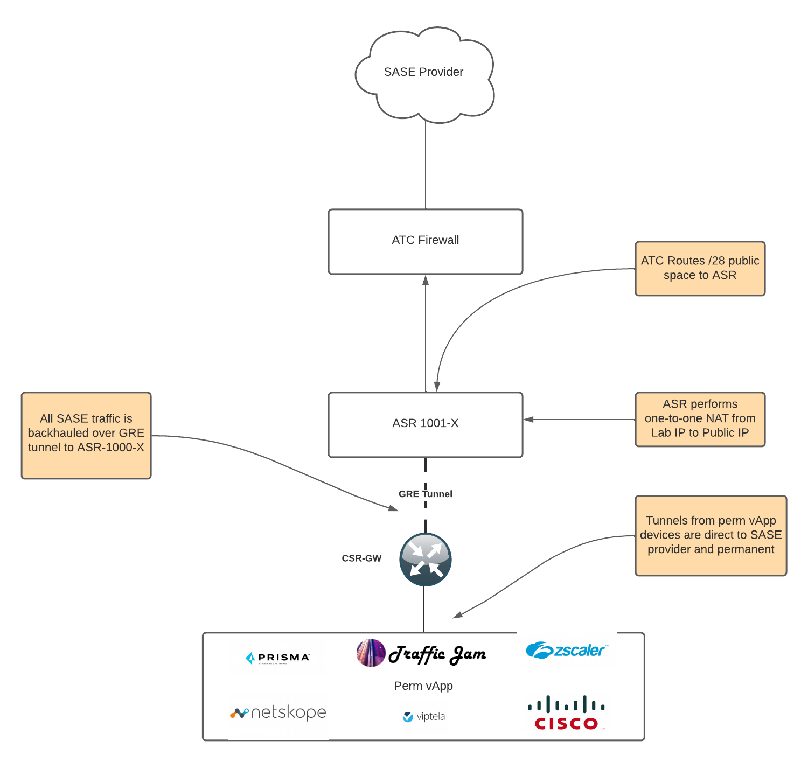

## VXLAN

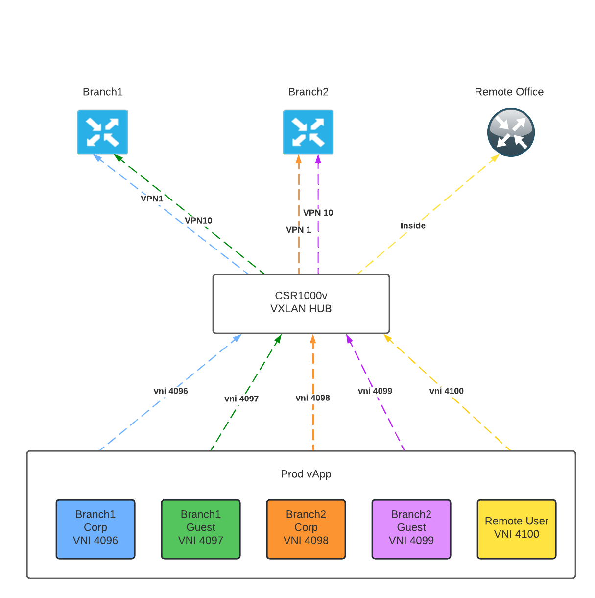

## vSuite Setup

1. Login to vCD-Perm and search for "SASE-Template" in Libraries

2. Create vApp from template 

   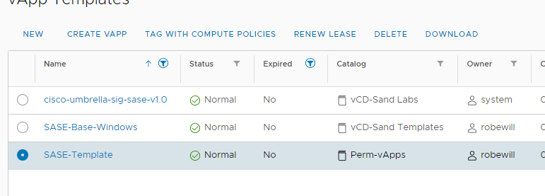

3. Name the vApp and accept all the defaults. 

4. Once the vApp is copied over look over the VMs and decide what you need powered on.  The CSR-GW, INET-TJ, vSuite(vManage, vSmart, vBond), and VxLan-hub are necessary components that need to powered on.  Everything else is replaceable if needed.

5. The first thing to do after the vApp is powered on is to get vManage setup.  Login to vManage by going to the https://{CSR-GW-IP}:8443.  CSR-GW-IP being the nic0 interface on the CSR-GW virtual machine.

   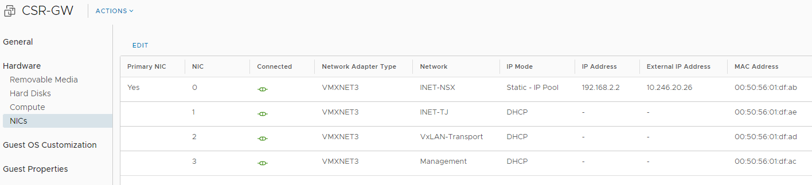

6. The lab is currently setup to use the ATC_LABSERVICES org.  You will need to be member of the virtual account to use that org.  This can be changed if needed.  Next we will enter our Cisco credentials under Administration-Settings.

   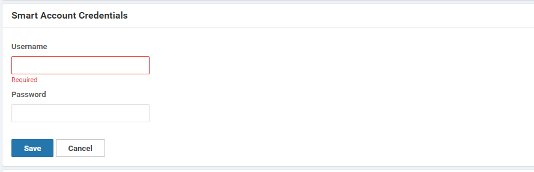

7. Once the credentials are in place we will now generate the certs for the lab.  Go to Configuration - Certs and click on Controllers at the top. 

8. Click on the ellipsis next to vManage and select generate CSR.

   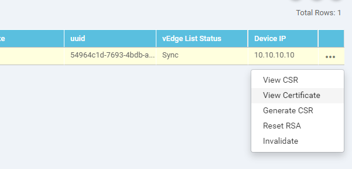

9. The CSR has now been sent to Cisco for signing.  This could take a little time so it's best to change the setting up Administration - Settings - Certificate Authorization and set that to something around five minutes.

10. Once the certificate is installed we will now add vBond and vSmart.  Navigate to Configuration - Devices and click on controllers at the top.

11. Now select add controller - vBond

    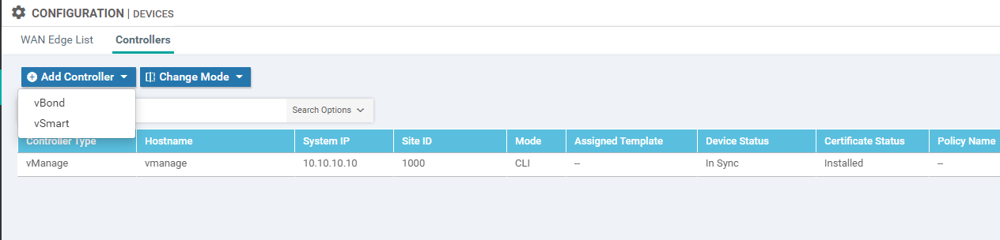

12. Enter in the vBond Management IP address (192.168.0.12) and the admin credentials.  Keep the box selected that will generate a CSR automatically.

13. Next we'll do the same for vSmart with a management IP of 192.168.0.11.

14. Once the certificates are downloaded ssh into vManage at the CSR-GW IP port 1235.  Add a tunnel interface to vpn 0 interface eth0.

    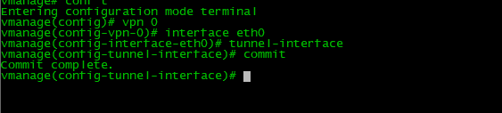

15. All the controllers should be up and in sync.  To verify navigate to Configuration - Devices and click on controllers.  The device status should all say "In Sync".  

16. Next we will need to upgrade vManage to 20.4.x.  This will allow us to import the 8000v devices.  Navigate to maintenance - Software Images and upload an image.  

17. After the image is uploaded we will apply the update.  Navigate to maintenance - software upgrade.  Click vManage at the top.  Select upgrade and then the version you want. Click upgrade and give some time for the operation to complete.

    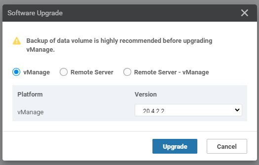

18. Next we need to activate the image we just installed.  This can be completed from Maintenance - Software upgrade.  Click on vManage and then activate.  Select the version you just installed. This will reboot vManage so give it around five to ten minutes to complete.

19. Next we'll bring in devices.  We'll do this by going to configuration - devices and selecting Sync Smart Account.  It'll prompt for your Cisco credentials.  Once those are entered it'll pull down all the devices in the virtual account and sync with vbond.

    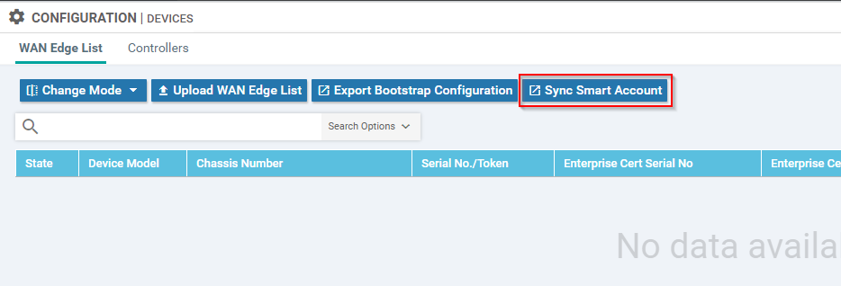

20. You should now see quite a few devices under Wan Edge List.  The most time consuming portion of the build is removing everything that is not needed.  We are working on a more automated way of doing this and will update once complete.

21. To delete a device first mark the certs as invalid under Configuration - Devices.  Once that is complete you can go back to the devices page and delete the device.

22. That completes the setup of the vSuite and devices are ready to configured.  Most have a basic configuration with what will be needed for the lab.  DHCP is needed on the Branch devices for the VxLan portion to work.


## VxLan Setup

1. This portion involves another vApp that resides in Sandbox and will be the on-demand portion of the lab.  The vApp is named "SASE-Base-Windows".  The vApp consists of five Windows VMs and a VyOS router.  There are two Windows VMs per branch and one for the remote office.  The VyOS participates in VxLan with the vxlan-hub in the perm vApp.

   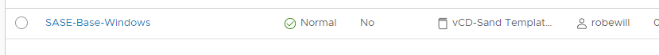

2. The only thing that needs to be changed in the prod vApp is the VxLan tunnel destination on the VyOS router.  SSH into the router and enter into configuration mode.

   ```
   admin@vyos-gw:~$ configure
   [edit]
   admin@vyos-gw#
   ```

3. Next we'll want to change the vxlan tunnel destinations.  

   ```
   admin@vyos-gw# set interfaces vxlan vxlan2 remote {perm-CSR-GW-IP}
   admin@vyos-gw# set interfaces vxlan vxlan3 remote {perm-CSR-GW-IP}
   admin@vyos-gw# set interfaces vxlan vxlan4 remote {perm-CSR-GW-IP}
   admin@vyos-gw# set interfaces vxlan vxlan5 remote {perm-CSR-GW-IP}
   admin@vyos-gw# set interfaces vxlan vxlan6 remote {perm-CSR-GW-IP}
   admin@vyos-gw# commit
   admin@vyos-gw# save
   ```

4. That should be it for the prod vApp.  The next section we'll go over setting up Ansible to dynamically add neighbors to the perm vApp.

## AWX/Ansible Setup

1. In this section we'll use the test AWX setup for GSD.  This is located at http://awx.campus.wwtatc.local:30659/.  Login is our admin credentials.

2. The first step is to create an inventory to store our vxlan hub.  Nagivate to resources - inventories.  Click Add - Add inventory

   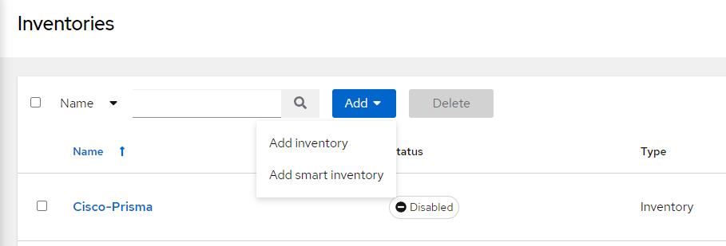

3. Once the inventory is created click on it and navigate to Hosts.  Click Add.  Give the host a name that makes sense to you and add the following variables (fill in the IP of your CSR-GW):

   ```
   ---
   gather_facts: false
   ansible_host: {CSR-GW-IP}
   ansible_connection: network_cli
   ansible_network_os: ios
   ansible_port: 1239
   ```

4.  We would usually need to supply credentials, but I have added CSR-Machine credentials already so feel free to use those.  You will need to supply your github SSH key to continue on to the next step.  Here is a link to generating the key:  https://git-scm.com/book/en/v2/Git-on-the-Server-Generating-Your-SSH-Public-Key.  You will then need to upload this key to github under your user account - SSH and GPG Keys.  Put the public key on github and the private key in AWX.

5. Now we need to create a project that will contain our templates(jobs).  Click on projects and then add.

6. Enter a name for the project (Suggest using BLD number).  Use AWX EE 0.3.0 for the execution environment and Git for the source control environment.  The source control will look similar to the screenshot below, but with your repository.  Select the credentials you created in the previous step.  Also select "Update Revision on Launch" as this will look for any changes to the script before running.

   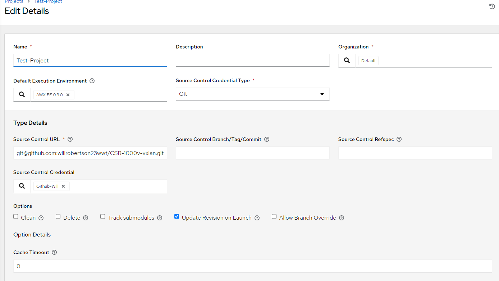

7. Next click on templates and verify that AWX pulls down the yaml files from github.  The yaml files can be copied from my repository at https://github.com/willrobertson23wwt/CSR-1000v-vxlan .  

8. The last step before running is adding a survey to each template.  This will allow the webhooks from the platform to add the prod vApp IP as a variable into the job.  Click on one of the jobs and navigate over to Survey.  Select Add and fill in the question field with something that reminds you of what this is.  Make the variable name "ip" and make the answer type Text. Hit save.

   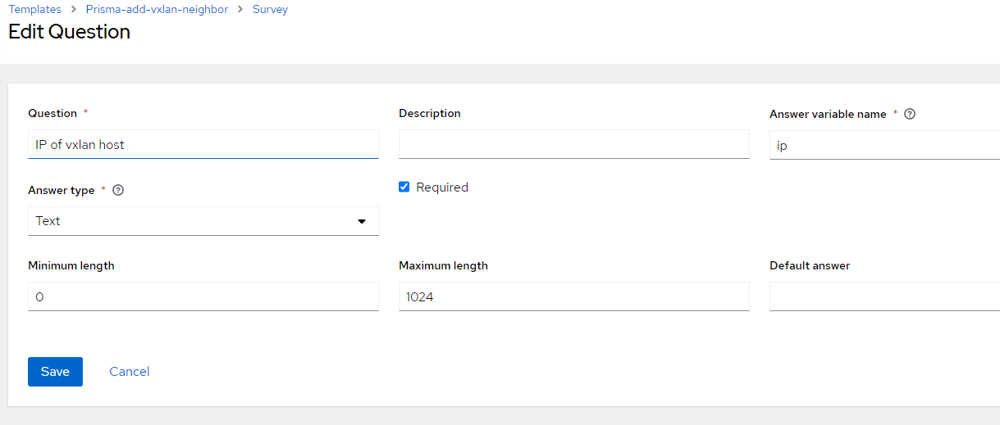

9. Now we're ready to test it out.  I recommend Postman for this and we'll be using it in this guide.  In order to test we'll need to use the correct URL for our specific jobs.  You can find this by clicking on the template and looking in the browser navigation bar.  

   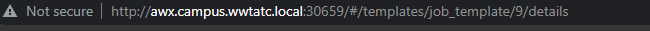

10. In this case the add neighbor job has a number of 9.  So we'll enter the below into Postman:

    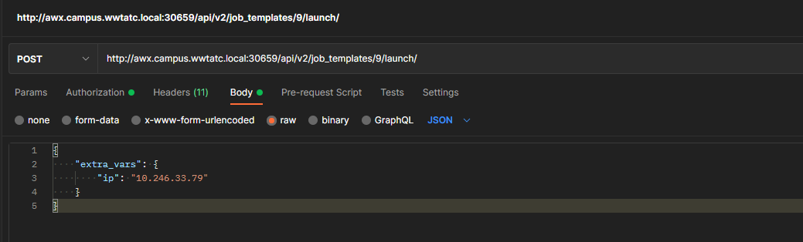

11. You'll notice in the body there is a section for "extra_vars" and this where we'll need to put in the IP of our prod vApp.  This will be dynamic for the platform webhooks, but for now we'll input them.  We'll also need to give postman some more info.  Click on Authorization and change the type to Basic Auth.  Input the credentials for AWX.  

12. Next we'll go to the Headers section and we'll need to add another line that looks like the below:

    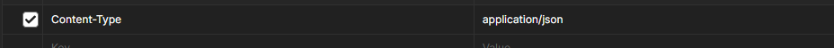

13. Now we're ready to run the test.  Click send and lets go back to AWX to check the progress.  Click on jobs and you see a couple things happening.  First AWX is checking github for any changes to the script.  Second the actual job should start running.  You can click on it and if successful it should look something like this:

    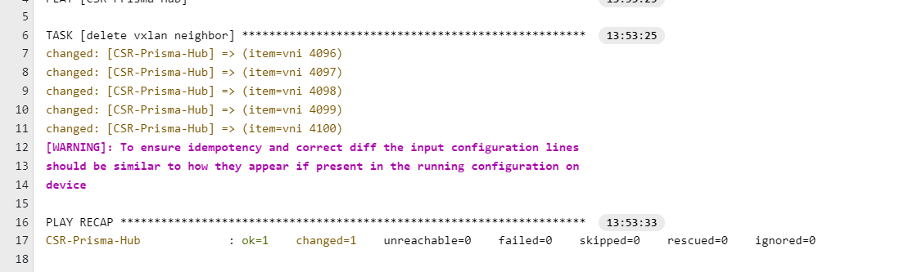

14. Now if we go to the vxlan-hub in the perm vApp we should see the new neighbors.  Now try to delete the neighbors.  If all is successful we should see Windows devices in the prod environment start to receive IP addresses.
